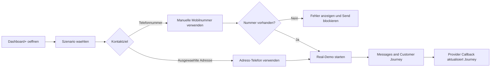

# Appointment Agent Demo Leitfaden v1.3.10 (DE)

## Demo-Fokus
`Dashboard+` ist die vereinfachte Vertriebsansicht. Presenter waehlen nur Szenario, Zielmodus Adresse oder Telefonnummer, Terminart und starten danach die Real-Modus-Journey.

## Story 1 - Real-Demo ueber ausgewaehlte Adresse
### Ziel
Zeigen, dass der Standardpfad weiterhin die Mobilnummer der ausgewaehlten Adresse nutzt.

### Schritte
1. `/ui/demo-monitoring/v1.3.10` oeffnen.
2. `Dashboard+` auswaehlen.
3. `Confirm appointment` waehlen.
4. Kontaktziel auf `Ausgewaehlte Adresse` lassen.
5. `Dentist` als Terminart waehlen.
6. Demo starten.
7. Outbound Prompt und Reply Suggestions in `Messages and Customer Journey` zeigen.

### Wichtige Punkte
- Das ist das bisherige adressbasierte Sendeverhalten mit weniger Bedienfeldern.
- Vertrieb muss Dashboard Mode, Guided Mode, Artefaktlinks und Operator Summary nicht bedienen.
- Der Real-Modus wartet auf den echten Provider Callback.

## Story 2 - Manuelle Mobilnummer
### Ziel
Zeigen, dass dieselbe Journey an eine waehrend der Demo eingegebene Mobilnummer gesendet werden kann.

### Schritte
1. Auf `Dashboard+` bleiben.
2. Radio Button `Telefonnummer` auswaehlen.
3. Eine Mobilnummer eintragen, zum Beispiel `+491701234567`.
4. Szenario und Terminart auswaehlen.
5. Demo starten.
6. Zeigen, dass die Journey die manuelle Zielnummer nutzt und die Adresse weiter Business-Kontext liefert.

### Wichtige Punkte
- Die manuelle Telefonnummer ueberschreibt nur die Outbound-Zielnummer.
- Die ausgewaehlte Adresse bleibt fuer Termin- und Korrelationskontext nutzbar.
- Das erleichtert Kundendemos, wenn Presenter ihr eigenes Mobilgeraet verwenden wollen.

## Story 3 - Fehlende Mobilnummer
### Ziel
Zeigen, dass die vereinfachte UI trotzdem sicher bleibt und nicht ohne Zielnummer sendet.

### Schritte
1. Radio Button `Telefonnummer` auswaehlen.
2. Telefonnummernfeld leer lassen.
3. Demo starten.
4. Fehlermeldung zur fehlenden Mobilnummer zeigen.
5. Nummer eintragen und erneut starten.

### Wichtige Punkte
- Das Cockpit blockiert Real-Versand ohne Mobilnummer.
- Der Fehler ist direkt im Operator Panel sichtbar.
- Die Sicherheitspruefung bleibt erhalten, obwohl die Demo-Oberflaeche einfacher ist.

## Story 4 - Bestehendes Dashboard fuer Deep Dive
### Ziel
Zeigen, dass das bestehende Dashboard fuer technische Nachfragen erhalten bleibt.

### Schritte
1. Nach Dashboard+ das bestehende `Dashboard` oeffnen.
2. Breitere Operator Controls, Artefakte und Summary Views zeigen.
3. Bei Bedarf `Message Monitor` oeffnen und normalisierten Nachrichtenverkehr zeigen.

### Wichtige Punkte
- `Dashboard+` ist die Presenter-Oberflaeche.
- `Dashboard` und `Message Monitor` bleiben die Diagnose-Oberflaechen.
- `v1.3.10` ist additiv und non-breaking.

## Ablaufplan

