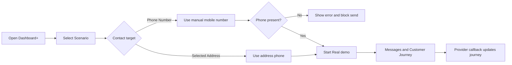

# Appointment Agent Demo Guide v1.3.10 (EN)

## Demo Focus
Use `Dashboard+` to run a simpler sales demonstration. The presenter should only need to choose a scenario, choose whether to send to an address phone or a manual mobile number, select the appointment type, and start the real-mode journey.

## Story 1 - Address-Based Real Demo
### Goal
Show the standard path where the selected address provides the mobile number.

### Steps
1. Open `/ui/demo-monitoring/v1.3.10`.
2. Select `Dashboard+`.
3. Choose `Confirm appointment`.
4. Keep contact target on `Selected Address`.
5. Select `Dentist` as appointment type.
6. Start the demo.
7. Show the outbound prompt and reply suggestions in `Messages and Customer Journey`.

### What To Call Out
- This is the previous address-based send behavior, but with fewer controls.
- Sales users do not need Dashboard Mode, Guided Mode, artifact links, or Operator Summary.
- Real mode waits for the actual provider callback.

## Story 2 - Manual Mobile Number Override
### Goal
Show that a presenter can send the same journey to a mobile number entered during the demo.

### Steps
1. Stay on `Dashboard+`.
2. Select the `Phone Number` radio button.
3. Enter a mobile number, for example `+491701234567`.
4. Choose a scenario and appointment type.
5. Start the demo.
6. Show that the journey uses the manual phone target while the address still provides business context.

### What To Call Out
- The manual phone number only overrides the outbound target.
- The selected address remains useful for appointment context and correlation.
- This makes customer-facing sales demos easier when the presenter wants to use their own device.

## Story 3 - Missing Mobile Number Guard
### Goal
Show that the simplified UI is still safe and does not send without a phone target.

### Steps
1. Select the `Phone Number` radio button.
2. Leave the phone field empty.
3. Try to start the demo.
4. Show the missing-mobile-number error.
5. Enter a number and start again.

### What To Call Out
- The cockpit blocks Real mode sends without a target mobile number.
- The error is visible in the Operator Panel.
- The guard keeps the sales demo simple without hiding safety checks.

## Story 4 - Existing Dashboard For Deep Dive
### Goal
Show that the existing dashboard remains available for technical follow-up.

### Steps
1. After running Dashboard+, open `Dashboard`.
2. Show the broader operator controls, artifacts, and summary views.
3. Open `Message Monitor` if the audience wants to inspect normalized traffic.

### What To Call Out
- `Dashboard+` is the presenter surface.
- `Dashboard` and `Message Monitor` remain the diagnostic surface.
- `v1.3.10` is additive and non-breaking.

## Flow Diagram

